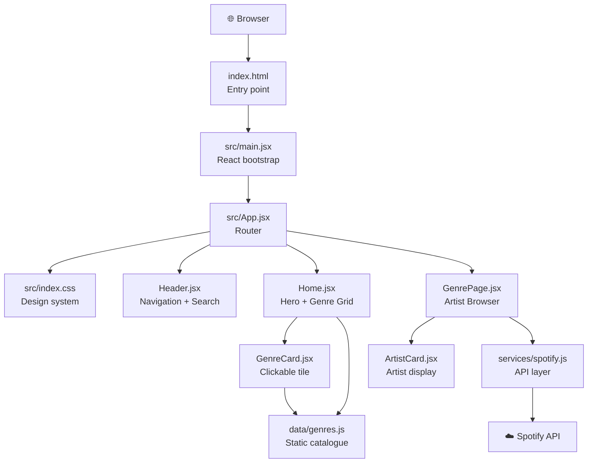

# 📁 explorenewmusic — Developer README

> Detailed breakdown of every file in the project — what it does, how it fits into the architecture, and its contribution to the website.

---

## Architecture Overview



---

## 🏗️ Project Configuration Files

---

### `package.json`
**Role:** Project manifest — defines the app's identity, scripts, and dependencies.

```json
{
  "name": "explorenewmusic",
  "scripts": {
    "dev":     "vite",        // Start local dev server at localhost:3000
    "build":   "vite build",  // Bundle for production into dist/
    "preview": "vite preview" // Preview the production build locally
  }
}
```

**Key dependencies:**

| Package | Why |
|---------|-----|
| `react` + `react-dom` | The UI framework — renders components to the DOM |
| `react-router-dom` | Client-side routing (`/` → Home, `/genre/:id` → GenrePage) |
| `vite` | Dev server + build tool (lightning fast HMR) |
| `@vitejs/plugin-react` | Enables JSX transforms in Vite |

---

### `vite.config.js`
**Role:** Configures the Vite build tool and dev server.

```js
export default defineConfig({
  plugins: [react()],   // Enable React/JSX support
  server: {
    port: 3000,         // Dev server runs at localhost:3000
    host: true          // Expose on network — needed for Docker later
  }
})
```

> `host: true` binds the server to `0.0.0.0` instead of just `localhost`. This is already set in anticipation of Docker, where containers must be reachable from outside the container's network namespace.

---

### `index.html`
**Role:** The single HTML shell that the browser loads. Vite injects the compiled JS/CSS into it at build time.

Key contributions:
- **SEO** — `<title>`, `<meta name="description">`, `<meta name="keywords">`
- **Open Graph** — `og:title` / `og:description` for social sharing previews
- **Google Fonts** — loads `Inter` (body text) and `Outfit` (headings) via CDN `<link>` tags
- **React mount point** — `<div id="root">` is where the entire React app renders
- **Entry script** — `<script type="module" src="/src/main.jsx">` tells Vite where to start bundling

---

### `.env.example`
**Role:** Template for the secrets file. Safe to commit — contains no real credentials.

```env
VITE_SPOTIFY_CLIENT_ID=your_spotify_client_id_here
VITE_SPOTIFY_CLIENT_SECRET=your_spotify_client_secret_here
```

Developers clone this → `cp .env.example .env` → fill in real values.
The `VITE_` prefix is **required** by Vite to expose variables to the browser bundle at build time.

---

### `.gitignore`
**Role:** Tells Git which files to never track.

Critical exclusions:

| Entry | Why excluded |
|-------|-------------|
| `node_modules/` | 152 packages, ~100MB — regenerated by `npm install` |
| `.env` | Contains real Spotify secrets — must never be committed |
| `dist/` | Generated build output, not source code |
| `.DS_Store` | macOS metadata files |

---

## 🎨 Design System

---

### `src/index.css`
**Role:** The global design system — the single source of truth for all visual tokens. Every component inherits from this file.

**What it defines:**

#### CSS Custom Properties (design tokens)
```css
:root {
  /* Backgrounds */
  --clr-bg-deep:     #0a0a0f;   /* Darkest layer */
  --clr-bg-base:     #0f0f1a;   /* Page background */
  --clr-bg-surface:  #161625;   /* Cards */
  --clr-bg-elevated: #1e1e35;   /* Hover states, inputs */

  /* Brand gradient — purple → cyan */
  --clr-primary:   #8b5cf6;
  --clr-accent:    #06b6d4;
  --grad-brand:    linear-gradient(135deg, #8b5cf6 0%, #06b6d4 100%);

  /* Per-genre vibe colors */
  --vibe-electronic: #8b5cf6;
  --vibe-jazz:       #f59e0b;
  --vibe-hiphop:     #ef4444;
  /* ... 9 more */

  /* Typography */
  --font-display: 'Outfit', sans-serif;  /* Headings */
  --font-body:    'Inter', sans-serif;   /* Body text */
}
```

#### Global Styles
- **CSS reset** — `box-sizing: border-box`, zero margin/padding on all elements
- **Ambient background** — two `radial-gradient` blobs fixed in the background (purple top-left, cyan bottom-right) that create a subtle atmospheric glow across the entire site
- **Custom scrollbar** — 6px wide, glows purple on hover
- **`.gradient-text`** — utility class that clips the brand gradient as text fill (used in headings)
- **`.skeleton`** — shimmer animation utility for loading placeholder cards
- **`.container`** — `max-width: 1280px` centered wrapper used by all page sections
- **`@keyframes fadeUp`** — cards and pages animate upward on entrance
- **`@keyframes shimmer`** — left-to-right sweep used by skeleton loaders

---

## ⚛️ React Application

---

### `src/main.jsx`
**Role:** The React bootstrap — the very first JavaScript that runs in the browser.

```jsx
ReactDOM.createRoot(document.getElementById('root')).render(
  <React.StrictMode>
    <App />
  </React.StrictMode>
)
```

- Grabs the `<div id="root">` from `index.html`
- Creates a React root and renders the entire `<App />` tree into it
- Imports `index.css` to activate the global design system
- `React.StrictMode` catches common mistakes during development (double-renders, deprecated APIs)

---

### `src/App.jsx`
**Role:** The application shell — sets up client-side routing and persistent layout.

```jsx
<BrowserRouter>
  <Header />              {/* Always visible on every page */}
  <main>
    <Routes>
      <Route path="/"               element={<Home />} />
      <Route path="/genre/:genreId" element={<GenrePage />} />
      <Route path="*"               element={<Home />} />  {/* 404 fallback */}
    </Routes>
  </main>
</BrowserRouter>
```

- **`BrowserRouter`** — uses the HTML5 History API for clean URLs (no `#` hashes)
- **`Header`** is rendered **outside** `<Routes>` so it persists across all pages without remounting
- **`:genreId`** is a URL parameter extracted by `GenrePage` via `useParams()`
- The wildcard `path="*"` catches unknown URLs and sends users back to Home

---

## 📊 Data Layer

---

### `src/data/genres.js`
**Role:** Static catalogue of 12 music genres. The in-app "database" — no network call needed.

Each genre object shape:
```js
{
  id:           'electronic',           // URL slug → /genre/electronic
  name:         'Electronic',           // Display name
  spotifyGenre: 'electronic',           // Query string sent to Spotify API
  emoji:        '⚡',                   // Visual identity in cards + hero banner
  description:  'Synthesized...',       // Paragraph shown on genre page
  vibe:         'Energetic · Futuristic · Immersive', // Tone label
  color:        '#8b5cf6',              // Injected as --card-color CSS variable
  gradient:     'linear-gradient(...)', // Injected as --card-gradient CSS variable
  tags:         ['synth', 'EDM', ...]   // Used in header search + tag pills
}
```

This file is imported by **four** different files:
- `Home.jsx` — iterates over all 12 to render the genre grid
- `GenreCard.jsx` — receives one genre as a prop and renders its tile
- `GenrePage.jsx` — looks up genre by URL param; uses `spotifyGenre` to call the API
- `Header.jsx` — filters the list in real-time for the search dropdown

---

### `src/services/spotify.js`
**Role:** All communication with the Spotify Web API. Isolates API logic from UI components.

**Authentication flow (Client Credentials):**
```
Component calls getArtistsByGenre("jazz")
  → getAccessToken() checks cache
    → if expired: POST /api/token with Base64(clientId:clientSecret)
      → Spotify returns { access_token, expires_in: 3600 }
      → token cached in memory for ~59 minutes
  → authenticated GET /search?q=genre:"jazz"&type=artist
    → returns Spotify artist objects
```

No user login is required — Client Credentials flow is server-to-server (app authenticates, not the user).

**Exported functions:**

| Function | Endpoint | What it returns |
|----------|----------|----------------|
| `getArtistsByGenre(genre, limit)` | `GET /search?q=genre:"jazz"&type=artist` | Array of artist objects |
| `getAvailableGenres()` | `GET /recommendations/available-genre-seeds` | Array of genre strings |
| `getArtist(artistId)` | `GET /artists/:id` | Single artist full profile |
| `getArtistTopTracks(artistId)` | `GET /artists/:id/top-tracks` | Array of track objects |
| `getRelatedArtists(artistId)` | `GET /artists/:id/related-artists` | Array of artist objects |

---

## 🧩 Components

---

### `src/components/Header.jsx` + `Header.css`
**Role:** Persistent top navigation bar with branding and live genre search.

**Three `useEffect` hooks:**

| Hook | Purpose |
|------|---------|
| `scroll` listener | Sets `scrolled: true` once user scrolls past 40px → triggers glassmorphism |
| `query` watcher | Filters `genres.js` in real-time as user types → updates dropdown |
| `mousedown` listener | Detects clicks outside the search box → closes dropdown |

**Glassmorphism on scroll:**
```css
.header--scrolled {
  background: rgba(10, 10, 15, 0.85);
  backdrop-filter: blur(20px);       /* Frosted glass effect */
  border-bottom: 1px solid var(--clr-border);
}
```

**Search flow:**
1. User types → `query` state updates
2. `useEffect` filters all 12 genres by `name` + `tags` → `results` state
3. Dropdown renders up to 5 matching genres
4. Clicking a result → `navigate('/genre/${id}')` — no page reload

---

### `src/components/GenreCard.jsx` + `GenreCard.css`
**Role:** Clickable animated tile for one music genre. Rendered 12× on the Home page.

**Per-genre CSS variable injection:**
```jsx
<Link style={{
  '--card-color':    genre.color,     // e.g. #f59e0b for Jazz
  '--card-gradient': genre.gradient,  // e.g. gold→red gradient for Jazz
}}>
```
The CSS then uses `var(--card-color)` for hover borders, glows, tag pills, and the CTA arrow — so every card is uniquely themed with zero JavaScript conditionals.

**Staggered entrance animation:**
```jsx
style={{ animationDelay: `${index * 60}ms` }}
```
Cards appear one after another (60ms apart) rather than all at once.

**Visual effects on hover:**
- Card lifts `translateY(-6px)` with deepened shadow
- Radial glow fades in from card color
- Emoji scales to 1.15× and rotates −5°
- CTA arrow slides rightward
- Bottom gradient bar fades in

---

### `src/components/ArtistCard.jsx` + `ArtistCard.css`
**Role:** Displays a single Spotify artist. Rendered in the GenrePage artist grid.

**Spotify artist data it uses:**

| Spotify field | Used for |
|---------------|----------|
| `images[0].url` | Profile photo (``) |
| `name` | Artist name heading |
| `genres[0]` | Genre label below name |
| `followers.total` | Formatted as "2.3M followers" via `Intl.NumberFormat` |
| `popularity` (0–100) | Drives the circular green ring |
| `external_urls.spotify` | Card `href` — opens Spotify profile |

**Popularity ring (CSS conic-gradient):**
```css
background: conic-gradient(
  #1DB954 var(--pop, 0%),         /* Spotify green fills % = popularity score */
  var(--clr-bg-elevated) 0%       /* Dark grey for remainder */
);
```
An artist with popularity 75 has 75% of the ring filled green.

---

## 📄 Pages

---

### `src/pages/Home.jsx` + `Home.css`
**Role:** The landing page — the first thing every user sees.

**Hero section:**
- Full-viewport-height (`min-height: 100vh`)
- 8 floating music emoji notes animated with `@keyframes floatNote` (staggered by CSS `--i` variable)
- Stats row: `{genres.length} Genres · ∞ Artists · Live Spotify Data`
- CTA button anchors to `#genres` section (smooth scroll via `scroll-behavior: smooth` in `index.css`)

**Genre grid:**
```jsx
{genres.map((genre, i) => (
  <GenreCard genre={genre} index={i} />
))}
```
- CSS Grid with `auto-fill, minmax(280px, 1fr)` → responsive columns, no media query needed
- `index` prop drives the staggered entrance animation delay

---

### `src/pages/GenrePage.jsx` + `GenrePage.css`
**Role:** The genre detail page — full genre profile + live Spotify artist browser.

**URL param → data flow:**
```
/genre/jazz
  → useParams() → { genreId: "jazz" }
  → genres.find(g => g.id === "jazz") → genre object
  → getArtistsByGenre(genre.spotifyGenre, 12) → Spotify API call
  → artists state → ArtistCard grid
```

**Three UI states:**

| State | Rendered |
|-------|---------|
| `loading: true` | 12 skeleton shimmer cards |
| `error: "message"` | Red error box + link to Spotify Developer Dashboard |
| `artists.length > 0` | Full `ArtistCard` grid |
| `artists.length === 0` | "No artists found" message |

**Hero banner theming:**
```jsx
<div style={{
  '--hero-gradient': genre.gradient,
  '--hero-color':    genre.color,
}}>
```
Two absolute-positioned blurred circles (`::before` / `::after`) behind the content create a genre-colored ambient glow — entirely in CSS with the injected variable.

**Related genres:**
Calculates `[currentIndex - 1, currentIndex + 1, currentIndex + 2]` from the genres array (wrapping with modulo), showing 3 sibling genre cards so users can keep exploring.

---

## 📐 Full Request Lifecycle

```
User visits localhost:3000
  → index.html served by Vite
    → main.jsx mounts React into <div id="root">
      → App.jsx wraps everything in BrowserRouter
        → Header.jsx renders (persistent across all routes)
        → Route "/" matched → Home.jsx renders
          → genres.js imported → 12 genre objects
          → 12 × GenreCard.jsx rendered in CSS grid

User clicks "Jazz" card
  → react-router navigates to /genre/jazz (no page reload)
    → Route "/genre/:genreId" matched → GenrePage.jsx renders
      → useParams() returns { genreId: "jazz" }
      → genres.find() returns Jazz genre object
      → getArtistsByGenre("jazz", 12) called
        → getAccessToken() → POST to Spotify accounts API
          → Bearer token returned + cached
        → GET /search?q=genre:"jazz"&type=artist
          → 12 artist objects returned
            → 12 × ArtistCard.jsx rendered with live data

User types "hip" in the header search
  → Header.jsx query state = "hip"
    → useEffect filters genres.js → ["Hip-Hop"]
      → Dropdown renders 1 result
        → User clicks → navigate("/genre/hip-hop")
          → GenrePage.jsx renders for Hip-Hop
```

---

## 🛣️ Roadmap

| Phase | Feature | Status |
|-------|---------|--------|
| 1 | Website with genre browser + Spotify artists | ✅ Done |
| 2 | Dockerfile + multi-stage build | 🔜 Next |
| 3 | Kubernetes manifests (Deployment, Service, Ingress) | 🔜 Later |
